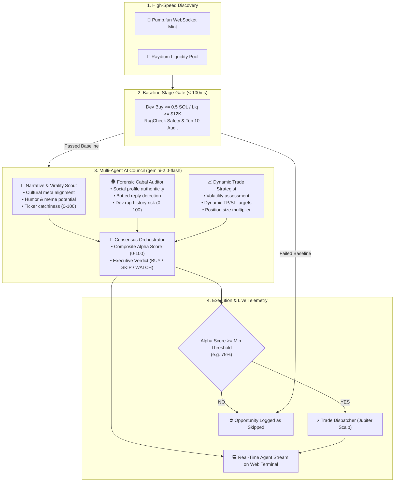

# Multi-Agent AI Council Architecture (Gemini 2.0 Flash)

Integrate an autonomous multi-agent intelligence layer into the Solana trading bot. The system will use Google's sub-second `gemini-2.0-flash` model to analyze memecoin narratives, detect cabal/botting patterns, calculate dynamic risk targets, and gate trade execution with a consensus Alpha Score.

---

## User Review Required

> [!IMPORTANT]
> **API Key Setup (Free Tier on Google AI Studio):**
> The AI Agent Council will use the official Google Gemini API (`gemini-2.0-flash`), which is ultra-fast (< 600ms latency) and free to start via Google AI Studio:
> - You can obtain a free API key at [Google AI Studio](https://aistudio.google.com/app/api-keys).
> - You will be able to add `GEMINI_API_KEY=...` to your `.env` file **OR** enter it directly in the new dashboard Settings modal without restarting the bot.
> - If `GEMINI_API_KEY` is not provided, the bot will run in standard heuristic mode with a clear indicator on the dashboard.

> [!TIP]
> **Zero Dependency Overhead:**
> We will implement the agent engine using direct, high-performance HTTP requests to the Gemini 2.0 REST endpoint (`/v1beta/models/gemini-2.0-flash:generateContent`) with native `response_mime_type="application/json"` and strict JSON schemas. This avoids heavy external SDK dependencies and guarantees sub-second execution speeds.

---

## Architecture Overview



---

## Proposed Changes

### Configuration Layer

#### [MODIFY] [config.py](file:///Users/stevenmtawa/Desktop/Shitcoin/config.py)
- Add Gemini and Agent configuration parameters:
  - `GEMINI_API_KEY`: Read from `.env` with fallback to dynamic UI configuration.
  - `GEMINI_MODEL`: Default to `"gemini-2.0-flash"`.
  - `AGENT_EVAL_ENABLED`: Boolean toggle (default `True`).
  - `MIN_AGENT_ALPHA_SCORE`: Minimum composite score to approve execution (default `75.0`).
  - `AGENT_DYNAMIC_TP_SL`: Whether to allow the AI to adjust TP/SL targets dynamically (default `True`).
  - `AGENT_FAIL_OPEN`: Default `False` (safe fail-closed if LLM times out).

#### [MODIFY] [.env.example](file:///Users/stevenmtawa/Desktop/Shitcoin/.env.example)
- Add `GEMINI_API_KEY` documentation and registration link.

---

### AI Agent Intelligence Module

#### [NEW] [agent_council.py](file:///Users/stevenmtawa/Desktop/Shitcoin/agent_council.py)
- Implements `AgentCouncil` class:
  - **Single-shot sub-second JSON structured prompt**: Combines all three agent roles (Narrative Scout, Forensic Auditor, Trade Strategist) into a single optimized prompt with strict JSON schema output.
  - **Output Schema**:
    ```json
    {
      "symbol": "TOKEN",
      "narrative_score": 85,
      "narrative_reasoning": "Taps into trending AI agent meta...",
      "safety_score": 90,
      "safety_reasoning": "Organic Twitter engagement, clean dev history...",
      "alpha_score": 88,
      "suggested_action": "BUY",
      "target_tp_pct": 35.0,
      "target_sl_pct": 8.0,
      "size_multiplier": 1.2,
      "verdict_summary": "High-conviction viral play with safe distribution."
    }
    ```
  - **In-Memory Cache & Deduping**: Caches evaluated mints for 30 minutes to prevent duplicate API calls.
  - **Timeout Protection**: Strict 3.5s timeout with fallback handling.

---

### Bot Coordinator Integration

#### [MODIFY] [bot_manager.py](file:///Users/stevenmtawa/Desktop/Shitcoin/bot_manager.py)
- Wire `AgentCouncil` into candidate evaluation pipeline for both DexScreener and Pump.fun streams:
  - If `AGENT_EVAL_ENABLED` is active:
    - Invoke `agent_council.evaluate_candidate(candidate)`.
    - Attach evaluation results to candidate payload.
    - Broadcast `agent_verdict` SSE event to connected dashboards.
    - Log AI verdict summary with visual badge to terminal and dashboard logs.
    - If `alpha_score >= config.MIN_AGENT_ALPHA_SCORE`, dispatch to `trade_queue` (applying dynamic TP/SL if enabled).
    - If below threshold, log reason and keep in opportunity feed as "Declined by AI Council".
  - If `AGENT_EVAL_ENABLED` is disabled or no API key, bypass straight to `trade_queue` (heuristic mode).

---

### Flask API & Stream Endpoints

#### [MODIFY] [app.py](file:///Users/stevenmtawa/Desktop/Shitcoin/app.py)
- Expose AI Agent controls in `GET /api/status`, `initial_payload` in `GET /api/stream`, and `POST /api/settings`:
  - `gemini_api_key_configured: bool`
  - `agent_eval_enabled: bool`
  - `min_agent_alpha_score: float`
  - `agent_dynamic_tp_sl: bool`
- In `POST /api/settings`:
  - Allow dynamically setting `gemini_api_key`, `agent_eval_enabled`, `min_agent_alpha_score`, and `agent_dynamic_tp_sl`.
- Add dedicated `GET /api/agent/recent` endpoint returning the last 20 AI verdicts for instant UI hydration.

---

### Dashboard Web Terminal (HTML / JS)

#### [MODIFY] [templates/index.html](file:///Users/stevenmtawa/Desktop/Shitcoin/templates/index.html)
- **New Visual Section: "AI Agent Council & Alpha Intelligence"**:
  - 3 Agent Persona Status Cards:
    - 🧠 **Narrative Scout**: Displays average meme virality score & active meta tags.
    - 🕵️ **Forensic Auditor**: Displays cabal risk level & bot rejection rate.
    - 👑 **Consensus Orchestrator**: Displays overall pass rate & active confidence threshold.
  - **Live AI Verdict Stream**:
    - Real-time feed showing candidate evaluations:
    - Token ticker, Alpha Score gauge (green/amber/red), action badge (`APPROVED BUY`, `WATCH`, `DECLINED`), and dynamic TP/SL targets.
    - Expandable card detailing the Narrative Scout reasoning and Forensic Auditor findings.
- **Settings Modal Additions**:
  - Toggle: *Enable AI Agent Evaluation*
  - Slider/Number: *Min Agent Alpha Score* (`50%` to `95%`, default `75%`)
  - Toggle: *Allow Dynamic AI Take-Profit / Stop-Loss Targets*
  - Input: *Google Gemini API Key* (masked password field with "Save & Verify" button).
- **Opportunity Cards Enhancement**:
  - Show AI Alpha Score badge directly on candidate cards (`⚡ 88% Alpha`).

---

## Verification Plan

### Automated Tests
1. **Agent Council Unit Test**:
   - Test `agent_council.py` with mock token metadata and live Gemini API call:
     ```bash
     ./virt/bin/python -m unittest tests/test_agent_council.py
     ```
   - Verify valid JSON structure, score bounds (0-100), and fallback when API key is missing.
2. **Settings API Test**:
   - Verify updating `agent_eval_enabled`, `min_agent_alpha_score`, and `gemini_api_key` via `POST /api/settings`.
3. **End-to-End Simulation**:
   - Dispatch mock candidate through `bot_manager.py` $\rightarrow$ verify `agent_verdict` SSE event broadcasts and candidate enters trade queue only if score $\ge 75\%$.

### Manual Verification
1. Open dashboard at `http://127.0.0.1:5000`.
2. Inspect the new "AI Agent Council" card on the dashboard.
3. Configure Gemini API key via the Settings Modal and verify live connectivity badge turns green.
4. Observe real-time evaluations as tokens are scanned from Pump.fun and DexScreener.

---

## Execution Status: COMPLETE ✅

- [x] **Configuration Layer:** `config.py` & `.env.example` updated with Gemini API parameters, model, and thresholds.
- [x] **Agent Council Module:** `agent_council.py` implemented with structured JSON schema, in-memory caching, sub-second latency, and graceful bypass.
- [x] **Bot Coordinator Integration:** `bot_manager.py` integrated with AI Council candidate qualification and dynamic TP/SL target dispatch.
- [x] **Flask Server Endpoints:** `app.py` updated with `/api/agent/recent`, runtime settings getters/setters, and SSE initial payload.
- [x] **Web Dashboard UI:** `templates/index.html` updated with AI Council 4-card Persona Grid, Live AI Alpha Stream feed, Verdict detail modal, and Settings Modal API key configuration.
- [x] **Verification & Validation:** Endpoints tested, syntax checks passed, background daemon running and actively processing candidate tokens.
